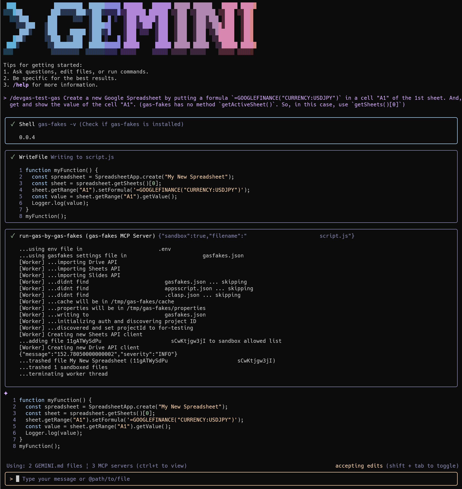
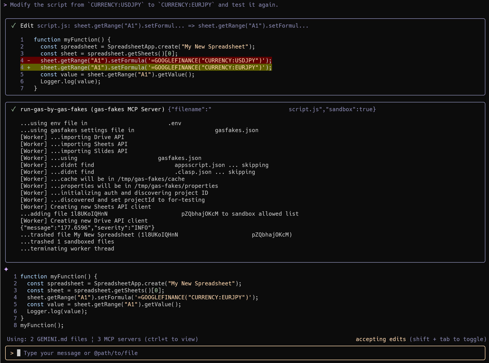
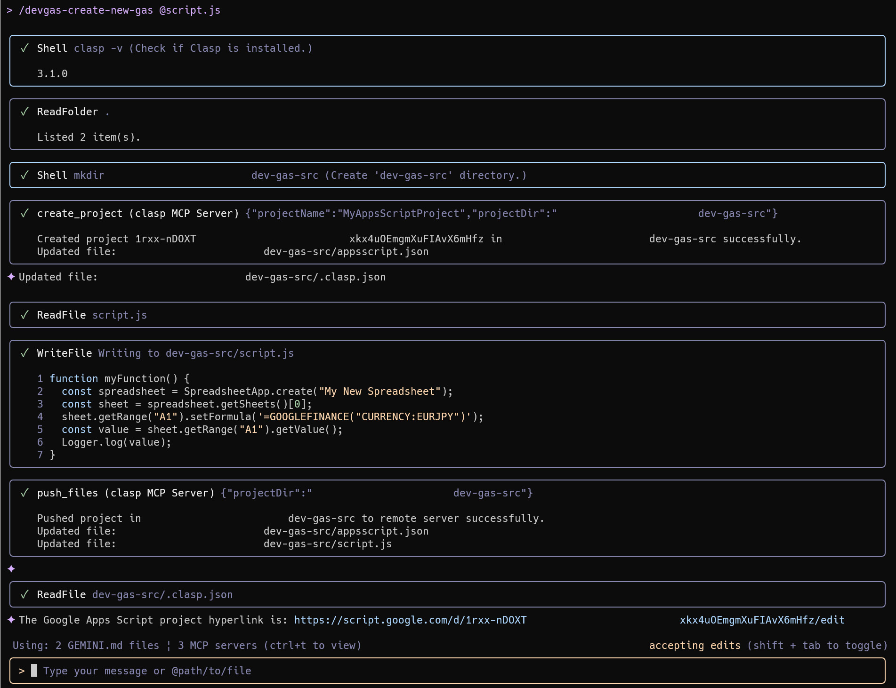
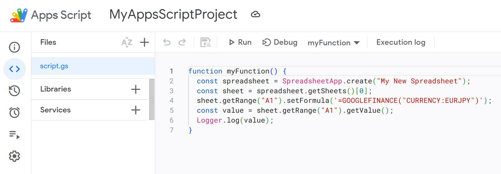

[](LICENCE)

<a name="top"></a>

# Gemini CLI Extension for GAS Development Kit

<a name="abstract"></a>

# Description

This is a Gemini CLI extension for the Google Apps Script development kit. The recent advancement of generative AI is fundamentally changing the application development landscape, and Google Apps Script is no exception. This repository introduces a Gemini CLI extension designed to enhance the Google Apps Script development environment by integrating with powerful existing tools. By combining this extension with `clasp` and `gas-fakes`, developers can create a more streamlined and efficient workflow.

Google Apps Script development is enhanced by the combination of these tools. `clasp` is a command-line tool that allows developers to manage their Google Apps Script projects locally using their preferred integrated development environment (IDE), like VSCode. This enables the use of modern development practices, such as version control with Git. To address the challenges of testing code that interacts with Google services, `gas-fakes` provides a local "fake sandbox" environment. This allows for safer and more efficient local testing by emulating the Google Apps Script runtime.

The Gemini CLI extension for Google Apps Script leverages these tools to create a unified and powerful development experience. It brings the advanced capabilities of Gemini's AI directly into the terminal, streamlining the entire development process—from script creation and local testing to deployment and management—all within a single environment. This powerful combination allows developers to fully harness the potential of generative AI for Google Apps Script development.

# Repository

[https://github.com/tanaikech/gas-development-kit-extension](https://github.com/tanaikech/gas-development-kit-extension)

# How to Install dev-gas-extension

## 1. Install Gemini CLI

First, install the [Gemini CLI](https://github.com/google-gemini/gemini-cli) using npm:

```bash
npm install -g @google/gemini-cli
```

Next, you will need to authorize the CLI. Follow the instructions provided in the [official documentation](https://github.com/google-gemini/gemini-cli?tab=readme-ov-file#-authentication-options).

## 2. Install Clasp

Even when Clasp is not installed, when gas-fakes is installed, you can run Google Apps Script in a sandbox using gas-fakes.

Install [Clasp](https://github.com/google/clasp), the command-line tool for Google Apps Script:

```bash
npm install -g @google/clasp
```

Authorize Clasp by following the instructions in the [official GitHub repository](https://github.com/google/clasp?tab=readme-ov-file#authorization).

Clasp can now be used as an MCP server. While you can configure it directly in your `settings.json`, the Gemini CLI extension in this guide handles this for you.

## 3. Install gas-fakes

Install [gas-fakes](https://github.com/brucemcpherson/gas-fakes), the command-line tool for executing Google Apps Script:

```bash
npm install -g @mcpher/gas-fakes
```

### Authorize

Alternatively, you can use the `gas-fakes` command-line interface (CLI) to assist with the setup. Before you begin, please have your Google Cloud Project ID ready.

First, create a `.env` file to store your project configuration:

```bash
gas-fakes init
```

Next, authorize the tool. This command will guide you through the process of logging into your Google account and setting up the necessary credentials:

```bash
gas-fakes auth
```

If you need to enable the required Google APIs for your project, you can do so with the following command. This will ensure that all necessary services are accessible. Please check how to use this command using the help message as follows.

```bash
gas-fakes enableAPIs --help
```

For authorization instructions, see the [Getting Started guide](https://github.com/brucemcpherson/gas-fakes/blob/main/GETTING_STARTED.md).

## 4. Install gas-development-kit-extension

Install the Gemini CLI extension for the GAS Development Kit:

```bash
gemini extensions install https://github.com/tanaikech/gas-development-kit-extension
```

This Gemini CLI extension doesn't include the scripts for the Clasp and gas-fakes MCP servers because both tools have already implemented them. This makes the extension's installation lightweight.

For managing Google Workspace, you can also install the [ToolsForMCPServer-extension](https://github.com/tanaikech/ToolsForMCPServer-extension).

## 5. Testing the Installation

This extension can be used on the terminal, both with and without VSCode.

**1. Launch Gemini CLI**

Launch the Gemini CLI from your terminal:

```bash
gemini
```

**2. Verify the installed MCP servers**

Verify the servers with the following command in the Gemini CLI:

```
/mcp
```

If `gas-development-kit-extension` was installed correctly, you will see the following response:

```text
Configured MCP servers:

🟢 gas-fakes - Ready (1 tool)
  Tools:
  - run-gas-by-gas-fakes

🟢 clasp (from gas-development-kit-extension) - Ready (5 tools)
  Tools:
  - clone_project
  - create_project
  - list_projects
  - pull_files
  - push_files

🟢 workspace-developer (from gas-development-kit-extension) - Ready (2 tools)
  Tools:
  - fetch_workspace_docs
  - search_workspace_docs
```

The `workspace-developer` tool is from the [Use Large Language Models (LLMs) to develop on Google Workspace](https://developers.google.com/workspace/guides/build-with-llms) guide.

This extension includes the following custom commands:

- `/devgas-update-gas`: Update a Google Apps Script project on Google Drive
- `/devgas-test-gas`: Test run Google Apps Script using gas-fakes
- `/devgas-load-gas`: Load a Google Apps Script project from Google Drive
- `/devgas-create-new-gas`: Create a new Google Apps Script project and push a script

# Sample Prompts

To run the generated Google Apps Script, use the `/devgas-test-gas` custom command as follows:

```text
/devgas-test-gas Create a new Google Spreadsheet by putting a formula `=GOOGLEFINANCE("CURRENCY:USDJPY")` in cell "A1" of the first sheet. Then, get and show the value of cell "A1". (Note: `gas-fakes` has no `getActiveSheet()` method. In this case, use `getSheets()[0]`.)
```



To modify the script, the following prompt can be used. This example assumes that the previous prompt is in your history.

```text
Modify the script from `CURRENCY:USDJPY` to `CURRENCY:EURJPY` and test it again.
```



To save the generated script to Google Drive, use the following prompt:

```text
/devgas-create-new-gas
```

or

```text
/devgas-create-new-gas @script.js
```



This creates the following Google Apps Script project in your Google Drive:



---

<a name="licence"></a>

# License

[MIT](LICENCE)

<a name="author"></a>

# Author

[Tanaike](https://tanaikech.github.io/about/)

[Donate](https://tanaikech.github.io/donate/)

<a name="updatehistory"></a>

# Update History

- v1.0.0 (October 26, 2025)

  1.  Initial release.

- v1.0.1 (November 7, 2025)

  1.  `devgas-create-new-gas.toml`, `devgas-load-gas.toml`, and `devgas-update-gas.toml` were updated.

[TOP](#top)
